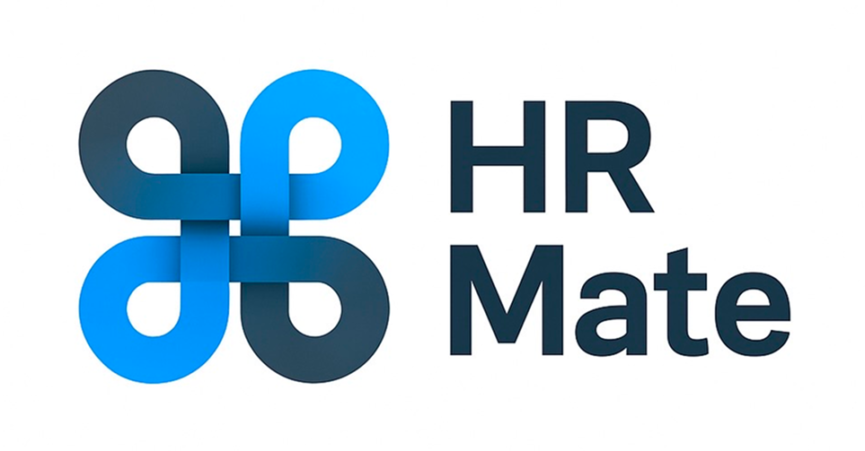

---

 

### О проекте

Сервис автоматизирует взаимодействие сотрудников с отделом кадров. Основная цель — упростить процесс подачи и 
обработки заявок, исключить бумажную работу и ускорить решение кадровых вопросов за счёт цифровизации 
документооборота между сотрудниками и HR-специалистами.

### Функционал:

- Регистрация и аутентификация сотрудников и HR
- Создание и просмотр заявок
- Управление статусами заявок (для HR)
- Управление статусами пользователей (для администратора)
- Разграничение доступа по ролям

 

### Технологии

- Go 1.22+
- PostgreSQL
- Docker
