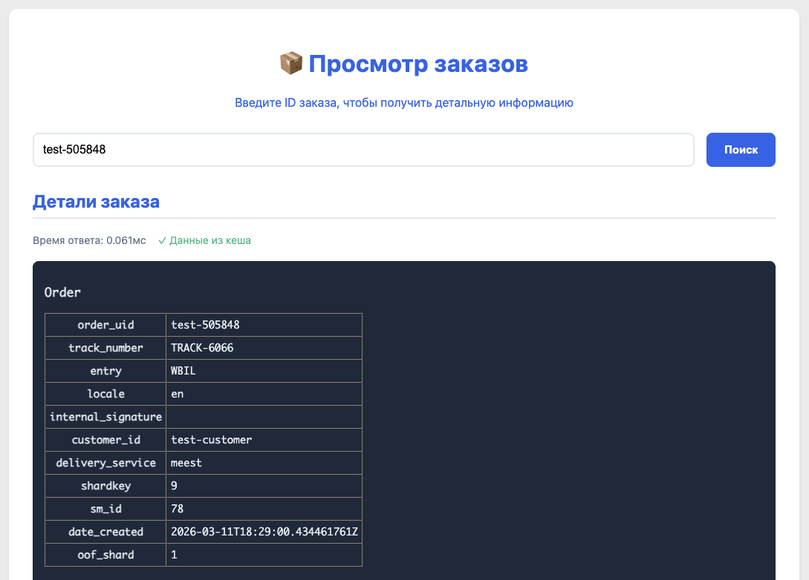

---

 

### О проекте

Сервис предназначен для приёма, обработки и хранения данных о заказах, поступающих через Kafka. Основная цель — обеспечить надёжное хранение заказов в PostgreSQL и быстрый доступ к ним через кэширование в памяти. Сервис включает простой веб-интерфейс для просмотра информации о заказе по его идентификатору.

### Ключевой функционал

**Интеграция с Kafka.** Сервис подписывается на топик с данными заказов и обрабатывает входящие сообщения в реальном времени.

**Валидация и обработка ошибок.** Некорректные или невалидные сообщения логируются и игнорируются, не нарушая работу сервиса.

**Сохранение в PostgreSQL.** Данные заказов сохраняются в нормализованную структуру БД с использованием транзакций для обеспечения целостности.

**In-memory кэширование.** Последние полученные заказы хранятся в памяти (map) для мгновенного доступа без обращения к БД.

**Восстановление кэша при старте.** При запуске сервис автоматически заполняет кэш данными из базы, что гарантирует отказоустойчивость после перезапусков.

**HTTP API.** Эндпоинт для получения данных заказа по ID (JSON) с приоритетным обращением к кэшу и fallback к БД.

**Веб-интерфейс.** Простая HTML-страница для ввода ID заказа и отображения информации, полученной от API.

### Архитектурные решения

Сервис написан на Go, что обеспечивает высокую производительность при работе с большим потоком сообщений. Для работы с Kafka используется надежный клиент с подтверждением сообщений (commit), чтобы гарантировать, что данные не теряются при сбоях.

База данных PostgreSQL спроектирована с учётом структуры входящего JSON: заказы хранятся в связанных таблицах (заказ, доставка, оплата, товары) для нормализации данных.

Кэш реализован как потокобезопасная структура с мьютексами, что позволяет безопасно работать с ним из нескольких горутин одновременно.

### Обработка ошибок и отказоустойчивость

- Транзакции БД гарантируют атомарность при сохранении связанных данных
- Подтверждение сообщений Kafka только после успешного сохранения в БД
- Логирование всех ошибок для мониторинга и отладки

### Технологии

- **Язык:** Go 1.22+
- **Брокер сообщений:** Apache Kafka
- **База данных:** PostgreSQL
- **Кэширование:** In-memory
- **Контейнеризация:** Docker, Docker Compose